# Self-Driving Car Engineer Nanodegree

## Deep Learning

## Project: Build a Traffic Sign Recognition Classifier
---

## Dataset Summary & Exploration

#### 1. Provide a basic summary of the data set. In the code, the analysis should be done using python, numpy and/or pandas methods rather than hardcoding results manually.

* The size of training set is ?   
   Number of training examples = 34799  
* The size of the validation set is ?   
  Number of validating examples = 4410   
* The size of test set is ?   
  Number of validating examples = 4410   
* The shape of a traffic sign image is ?   
  Image data shape = (32, 32, 3)   
* The number of unique classes/labels in the data set is ?   
  Number of classes = 43  


#### 2. Include an exploratory visualization of the dataset.

Here is an exploratory visualization of the data set. It is a bar chart showing how the data ...


##  Randomly show special class iamges`

    Show Class = [8],Name=[Speed limit (120km/h)] from data set,Show length is [10],Total length is [1260]
    


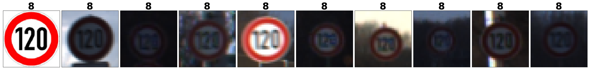


##  Randomly show all classes iamges

    Random show each class form data set:
    


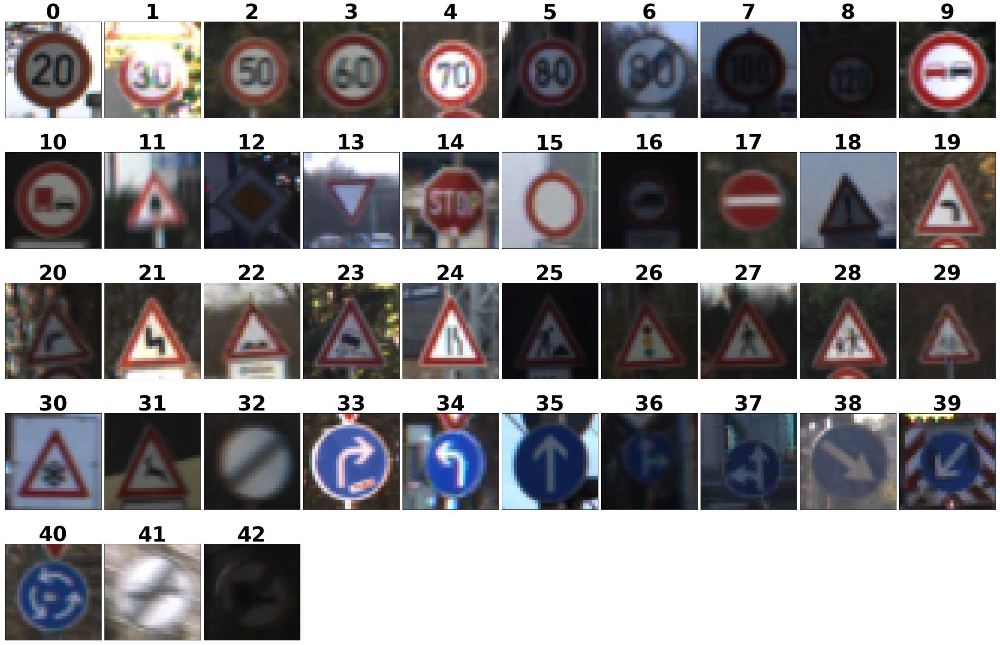


```python
# show_class_by_class_images(X_train,y_train)
```

# Show class images histogram


#### Show per class images frequency

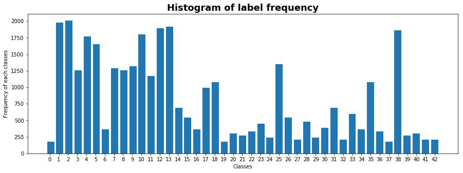


#### Show per class on train and test set


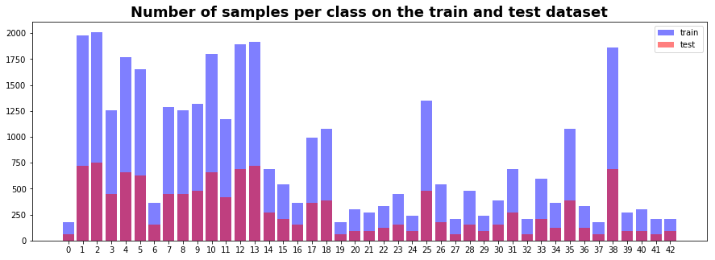


----

## Design and Test a Model Architecture

Design and implement a deep learning model that learns to recognize traffic signs. Train and test your model on the [German Traffic Sign Dataset](http://benchmark.ini.rub.de/?section=gtsrb&subsection=dataset).

## 1、Pre-process the Data Set

#### The original images is not balanced, so generate the iamges data


#### images generator

```python
gen_class_images_show(X_train,y_train,24)
```


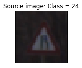


    Generating images... Class = 24
    Show Class = [24],Name=[Road narrows on the right] from data set,Show length is [20],Total length is [30]
    


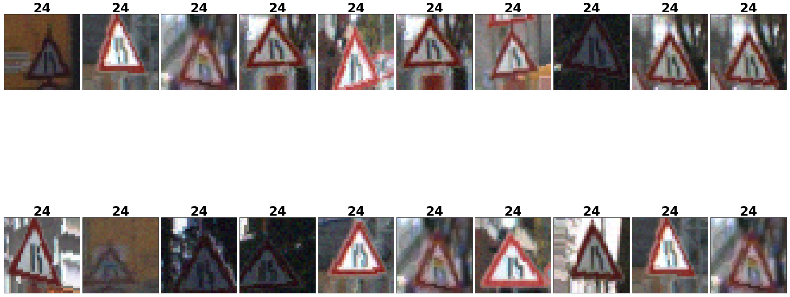


#### images data merge


```python
X_train = np.concatenate((X_train, X_valid), axis=0)
y_train = np.concatenate((y_train, y_valid), axis=0)
```

## Generator per class images to about 6000 to balace data

```python
X_train,y_train = gen_class_images(X_train,y_train)
```
    Class 38  : 2070, Generated samples numbers = 6060
    Class 39  :  300, Generated samples numbers = 6084
    Class 40  :  360, Generated samples numbers = 6016
    Class 41  :  240, Generated samples numbers = 6128
    Class 42  :  240, Generated samples numbers = 6128
    Generate images data has completed!
    

#### Save generated image data


```python
import pickle
gen_data_file = "traffic-signs-data/gen_data.p"
print("Generated iamges numbers = {}".format(len(X_train)))
pickle.dump({"images":X_train,"labels":y_train},open(gen_data_file,"wb"),protocol=4)
print("Generated images data has saved completly!")
```

    Generated iamges numbers = 43619
    Generated images data has saved completly!
    

#### Restore generated image data


```python
with open("traffic-signs-data/gen_data.p","rb") as f:
    image_data = pickle.load(f)

X_train,y_train = image_data["images"],image_data["labels"]
```

#### Split generated image data into train and valid set


```python
from sklearn.model_selection import train_test_split
X_train,X_valid,y_train,y_valid = train_test_split(X_train,y_train,test_size=0.2,random_state=42)
show_compared_histogram(y_train,y_valid)
```

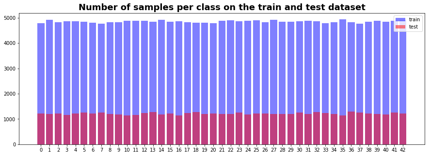

#### Normalize image data

For image data, `(pixel - 128.)/ 128.` is a quick way to approximately normalize the data . The image pixel is range [-1,1]. And it has mean 0. This process will made the model fastly convergence. The image as follows:

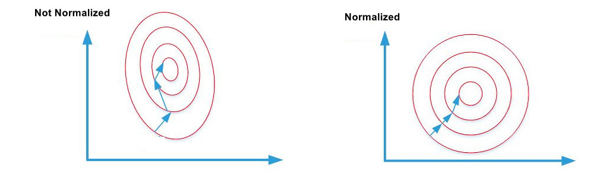

```python
X_train_normalized = (X_train - 128.)/128
X_valid_normalized = (X_valid - 128.)/128.
X_test_normalized =  (X_test - 128.)/128.
```

## 2、Model Architecture

My final model like VGG consisted of the following layers:

| Layer         		|     Description	        					| 
|:----------------------|:----------------------------------------------| 
| Input         		| 32x32x3 RGB image   							| 
| Convolution 3x3     	| 1x1 stride, same padding, outputs 32x32x32 	|
| RELU					|												|
| Convolution 3x3     	| 1x1 stride, same padding, outputs 32x32x32 	|
| RELU					|												|
| Max pooling	      	| 2x2 stride,  outputs 16x16x32 				|
| DropOut   	      	| keep Prob = 0.9 				                |
| Convolution 3x3     	| 1x1 stride, same padding, outputs 16x16x64 	|
| RELU					|												|
| Convolution 3x3     	| 1x1 stride, same padding, outputs 16x16x64 	|
| RELU					|												|
| Max pooling	      	| 2x2 stride,  outputs 8x8x64 			     	|
| DropOut   	      	| keep Prob = 0.9 				                |
| Convolution 3x3     	| 1x1 stride, same padding, outputs 8x8x128 	|
| RELU					|												|
| Convolution 3x3     	| 1x1 stride, same padding, outputs 8x8x128 	|
| RELU					|												|
| Max pooling	      	| 2x2 stride,  outputs 4x4x128 		     		|
| DropOut   	      	| keep Prob = 0.9 				                |
| Fully connected		| outputs 2048       				    		|
| DropOut   	      	| keep Prob = 0.8 				                |
| Fully connected		| outputs 2048       				    		|
| DropOut   	      	| keep Prob = 0.5 				                |
| Fully connected		| outputs 43        				    		|
| Softmax				| etc.        									|

## 3、Train, Validate and Test the Model

A validation set can be used to assess how well the model is performing. A low accuracy on the training and validation sets imply underfitting. A high accuracy on the training set but low accuracy on the validation set implies overfitting.

### Train mode parameters

In retrain model, the parameters as follows:    
* learning rate = 0.0005    
* loss rate = 0.0001    
* optimizer = Adam, add the L2 regularization to improve the perfomace    
* batch size = 128, it is limited to my GPU card    
* max epochs = 80, from the 8th, if there is no improvement among 10 epochs, it will stop in advance    
* Dropout parameters: keep_pro1 = 0.9, keep_pro2 = 0.8, keep_pro3 = 0.5   

```python
    EPOCH 48 ... Train Accuracy = 0.9998  Validation Accuracy = 0.9984
    Current Best Validation Accuracy = 0.9984 has saved completely!
    EPOCH 49 ... Train Accuracy = 0.9991  Validation Accuracy = 0.9965
    EPOCH 50 ... Train Accuracy = 0.9995  Validation Accuracy = 0.9978
    EPOCH 51 ... Train Accuracy = 0.9994  Validation Accuracy = 0.9977
    EPOCH 52 ... Train Accuracy = 0.9991  Validation Accuracy = 0.9972
    EPOCH 53 ... Train Accuracy = 0.9996  Validation Accuracy = 0.9980
    EPOCH 54 ... Train Accuracy = 0.9988  Validation Accuracy = 0.9970
    EPOCH 55 ... Train Accuracy = 0.9997  Validation Accuracy = 0.9984
    EPOCH 56 ... Train Accuracy = 0.9996  Validation Accuracy = 0.9979
    EPOCH 57 ... Train Accuracy = 0.9995  Validation Accuracy = 0.9980
    EPOCH 58 ... Train Accuracy = 0.9988  Validation Accuracy = 0.9967
    EPOCH 59 ... Train Accuracy = 0.9995  Validation Accuracy = 0.9978
    10 epochs have no improvement after the best validation accuracy = 0.9984
    Best Accuracy = 0.9984 Model has saved!
```

#### FineTune model parameters different from Retrain parameters      
* learning rate = 0.0001      
* Dropout parameters: keep_pro1 = 0.9, keep_pro2 = 0.75, keep_pro3 = 0.5   
* other parameters are as same as retrain parameters    

```python
    EPOCH 11 ... Train Accuracy = 1.0000  Validation Accuracy = 0.9992
    Current Best Validation Accuracy = 0.9992 has saved completely!
    EPOCH 12 ... Train Accuracy = 1.0000  Validation Accuracy = 0.9988
    EPOCH 13 ... Train Accuracy = 1.0000  Validation Accuracy = 0.9991
    EPOCH 14 ... Train Accuracy = 1.0000  Validation Accuracy = 0.9991
    EPOCH 15 ... Train Accuracy = 1.0000  Validation Accuracy = 0.9989
    EPOCH 16 ... Train Accuracy = 1.0000  Validation Accuracy = 0.9990
    EPOCH 17 ... Train Accuracy = 1.0000  Validation Accuracy = 0.9987
    EPOCH 18 ... Train Accuracy = 1.0000  Validation Accuracy = 0.9991
    EPOCH 19 ... Train Accuracy = 0.9999  Validation Accuracy = 0.9986
    EPOCH 20 ... Train Accuracy = 0.9999  Validation Accuracy = 0.9987
    EPOCH 21 ... Train Accuracy = 1.0000  Validation Accuracy = 0.9989
    EPOCH 22 ... Train Accuracy = 1.0000  Validation Accuracy = 0.9990
    10 epochs have no improvement after the best validation accuracy = 0.9992
    Best Accuracy = 0.9992 Model has saved!
```    

## 4、Describe the approach

My final model results were:   
* training set accuracy of ?   
  Train Accuracy = 1.0000   
* validation set accuracy of ?   
  Validation Accuracy = 0.9990    
* test set accuracy of ?    
  Test Accuracy = 0.9879     

An iterative approach was chosen:    
* What was the first architecture that was tried and why was it chosen?    
  firstly, I choose the model like Lenet, becouse it is classics.    
* What were some problems with the initial architecture?    
  It is easyly overfitting.    
* How was the architecture adjusted and why was it adjusted? Typical adjustments could include choosing a different model architecture, adding or taking away layers (pooling, dropout, convolution, etc), using an activation function or changing the activation function. One common justification for adjusting an architecture would be due to overfitting or underfitting. A high accuracy on the training set but low accuracy on the validation set indicates over fitting; a low accuracy on both sets indicates under fitting.    
 Avoid overfitting, I add dropout layers after two conv layers. I choose Relu function as activation function to avoid vanishing gradient.     
* Which parameters were tuned? How were they adjusted and why?    
  I tune learning rate to 0.0001 in finetue model. Because reducing learing rate can make the loss function to minimum instead of oscillating back and forth.    
* What are some of the important design choices and why were they chosen? For example, why might a convolution layer work well with this problem? How might a dropout layer help with creating a successful model?    
 Dropout and L2 regularization are very important. These design choices can avoid overfitting.    

## 5、Analysis Error Images

 Through the following picture, we known the images which have a shadow or over exposure lead to accuracy lowly.    
```
    The number of incorrectly predict labels is 153
```    


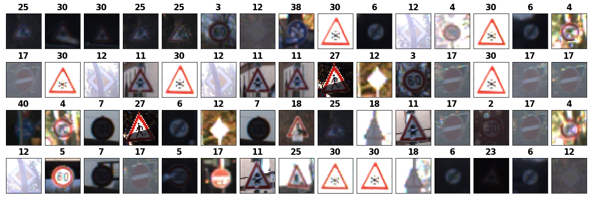

---

## Test a Model on New Images

#### 1. Choose five German traffic signs found on the web and provide them in the report. For each image, discuss what quality or qualities might be difficult to classify.

Here are five German traffic signs that I found on the web:

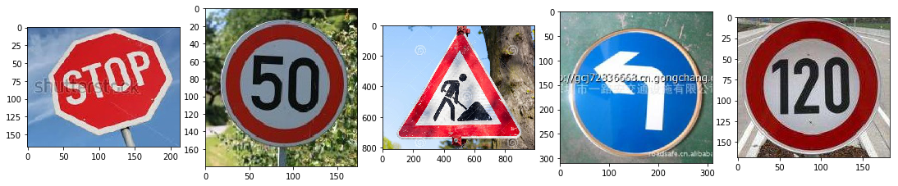

    The first and the fourth image might be difficult to classify because beacuse of the irrelevant information like the watermark in the images.

#### 2. Discuss the model's predictions on these new traffic signs and compare the results to predicting on the test set. At a minimum, discuss what the predictions were, the accuracy on these new predictions, and compare the accuracy to the accuracy on the test set (OPTIONAL: Discuss the results in more detail as described in the "Stand Out Suggestions" part of the rubric).

Here are the results of the prediction:

| Image			        |     Prediction	        					| 
|:----------------------|:----------------------------------------------| 
| Stop                  | Stop                    			     		| 
| Speed limit (50km/h)  | Speed limit (50km/h)  						|
| Road work         	| Road work         							|
| Turn left ahead  		| Turn left ahead		    	 				|
| Speed limit (120km/h)	| Speed limit (120km/h) 							|
    
The model was able to correctly guess 5 of the 5 traffic signs, which gives an accuracy of 100%. This compares favorably to the accuracy on the test set of 98.79%       

#### 3. Describe how certain the model is when predicting on each of the five new images by looking at the softmax probabilities for each prediction. Provide the top 5 softmax probabilities for each image along with the sign type of each probability. (OPTIONAL: as described in the "Stand Out Suggestions" part of the rubric, visualizations can also be provided such as bar charts)

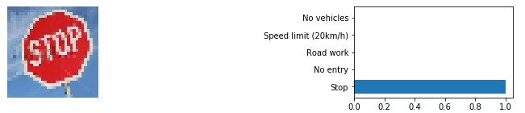
 ```
  For the first image, the model rightly predicts Stop sign(probability of 1), and the image does contain a Stop sign. The top five soft max probabilities were:   
    * P0: 1.000000 - Stop
    * P1: 0.000000 - No entry
    * P2: 0.000000 - Road work
    * P3: 0.000000 - Speed limit (20km/h)
    * P4: 0.000000 - No vehicles
```
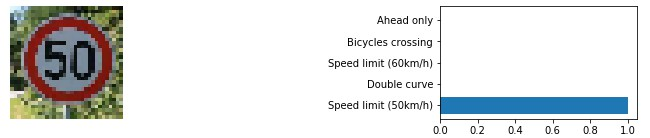
```
For the second image, the model is sure that this is a Speed limit (50km/h) sign (probability of 1), and the image does contain a Speed limit (50km/h) sign. The top five soft max probabilities were    
    * P0: 1.000000 - Speed limit (50km/h)
    * P1: 0.000000 - Double curve
    * P2: 0.000000 - Speed limit (60km/h)
    * P3: 0.000000 - Bicycles crossing
    * P4: 0.000000 - Ahead only
```
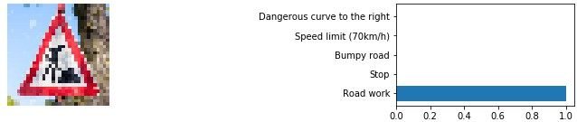
```
For the third image, the model is sure that this is a Road work sign (probability of 1), and the image does contain a Road work sign. The top five soft max probabilities were    
    * P0: 1.000000 - Road work
    * P1: 0.000000 - Stop
    * P2: 0.000000 - Bumpy road
    * P3: 0.000000 - Speed limit (70km/h)
    * P4: 0.000000 - Dangerous curve to the right
```
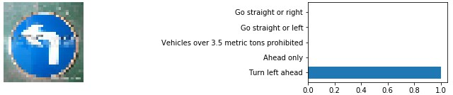
```
For the fourth image, the model is sure that this is a Turn left ahead sign (probability of 1), and the image does contain a Turn left ahead sign. The top five soft max probabilities were    
    * P0: 1.000000 - Turn left ahead
    * P1: 0.000000 - Ahead only
    * P2: 0.000000 - Vehicles over 3.5 metric tons prohibited
    * P3: 0.000000 - Go straight or left
    * P4: 0.000000 - Go straight or right
```
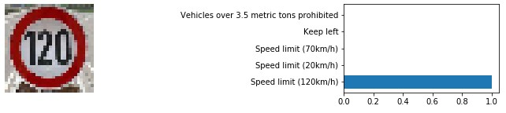
```
For the fifth image, the model is sure that this is a Speed limit (120km/h) sign (probability of 1), and the image does contain a Speed limit (120km/h) sign. The top five soft max probabilities were    
    * P0: 0.999934 - Speed limit (120km/h)
    * P1: 0.000066 - Speed limit (20km/h)
    * P2: 0.000000 - Speed limit (70km/h)
    * P3: 0.000000 - Keep left
    * P4: 0.000000 - Vehicles over 3.5 metric tons prohibited
```    


---

### (Optional) Visualizing the Neural Network (See Step 4 of the Ipython notebook for more details)
#### 1. Discuss the visual output of your trained network's feature maps. What characteristics did the neural network use to make classifications?


### Conv Layer 1


```python
output_Layer_FeatureMap(image_input,1)
```

    INFO:tensorflow:Restoring parameters from ./model/
    Tensor("conv1_activation:0", shape=(?, 32, 32, 32), dtype=float32)
    


### Conv Layer 2


```python
output_Layer_FeatureMap(image_input,2)
```

    INFO:tensorflow:Restoring parameters from ./model/
    Tensor("conv2_activation:0", shape=(?, 32, 32, 32), dtype=float32)
    


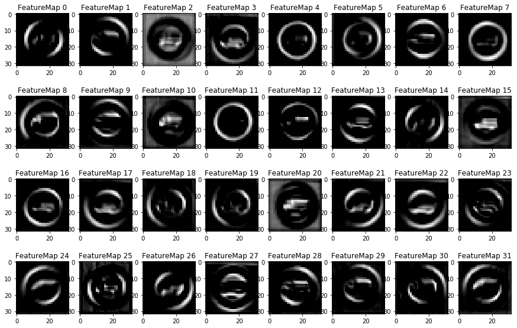


### Conv Layer 3


```python
output_Layer_FeatureMap(image_input,3)
```

    INFO:tensorflow:Restoring parameters from ./model/
    Tensor("conv3_activation:0", shape=(?, 16, 16, 64), dtype=float32)
    


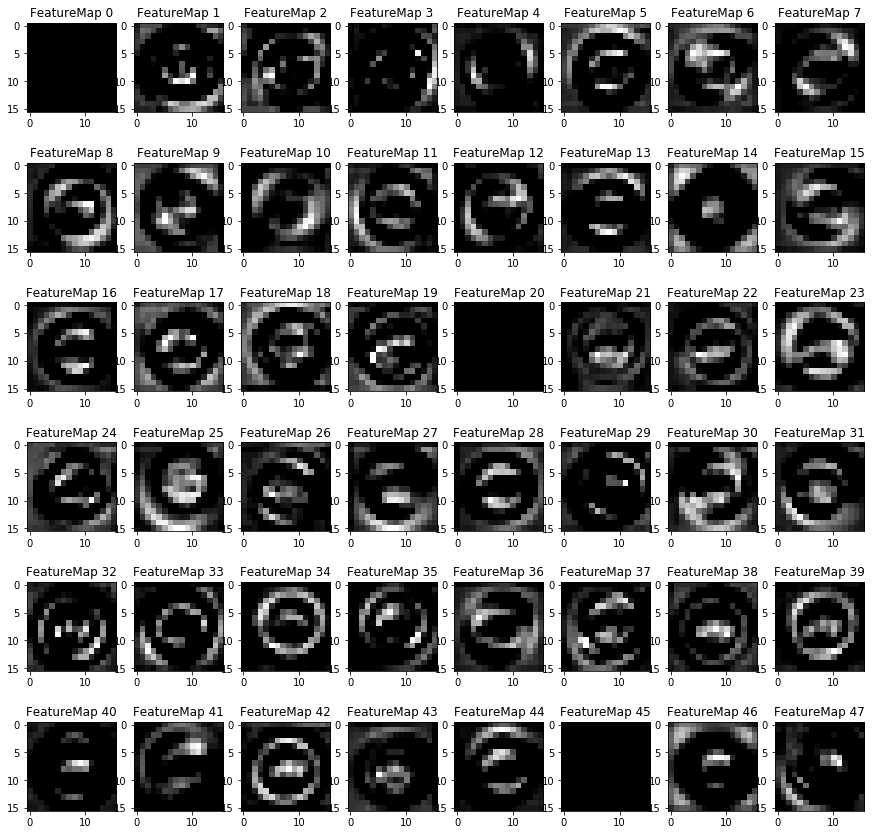


```python
output_Layer_FeatureMap(image_input,4)
```

    INFO:tensorflow:Restoring parameters from ./model/
    Tensor("conv4_activation:0", shape=(?, 16, 16, 64), dtype=float32)
    


```python
output_Layer_FeatureMap(image_input,4)
```

    INFO:tensorflow:Restoring parameters from ./model/
    Tensor("conv4_activation:0", shape=(?, 16, 16, 64), dtype=float32)
    


```python
output_Layer_FeatureMap(image_input,5)
```

    INFO:tensorflow:Restoring parameters from ./model/
    Tensor("conv5_activation:0", shape=(?, 8, 8, 128), dtype=float32)
    


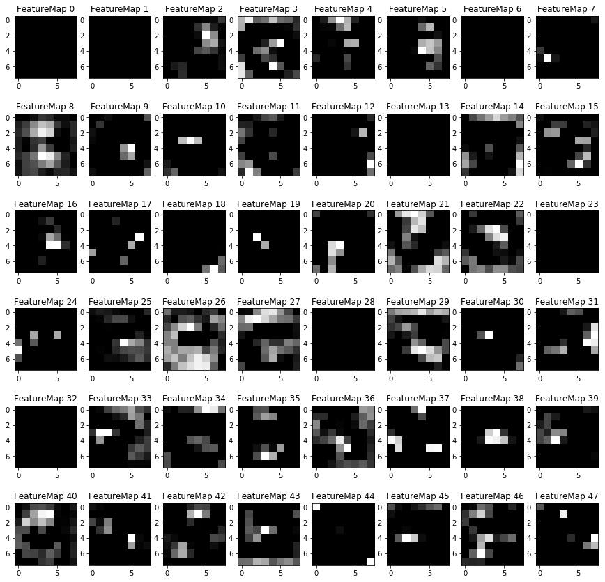


```python
output_Layer_FeatureMap(image_input,6)
```

    INFO:tensorflow:Restoring parameters from ./model/
    Tensor("conv6_activation:0", shape=(?, 8, 8, 128), dtype=float32)
    


