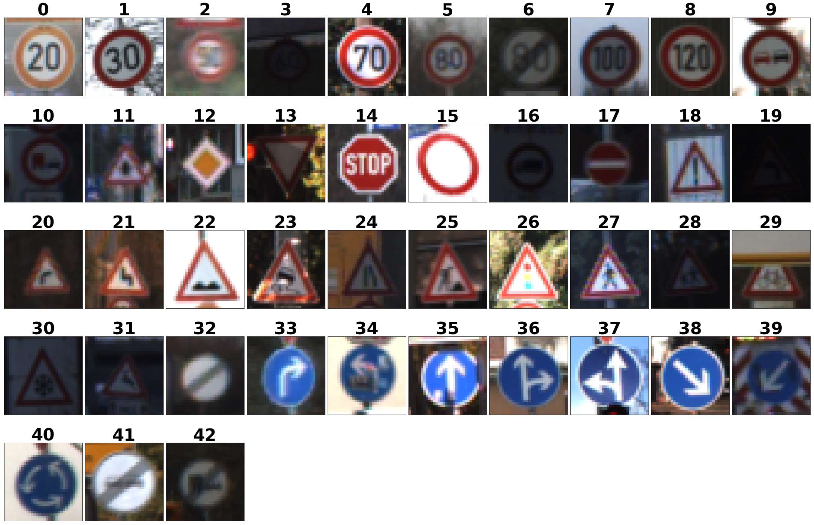
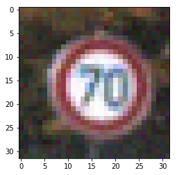
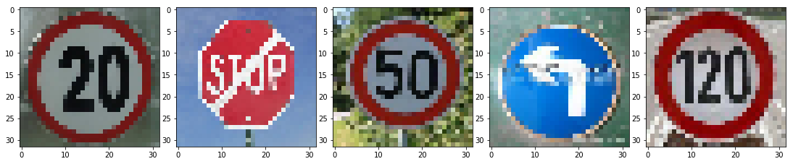
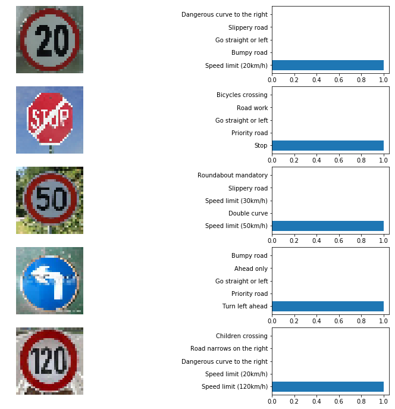
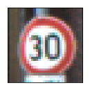
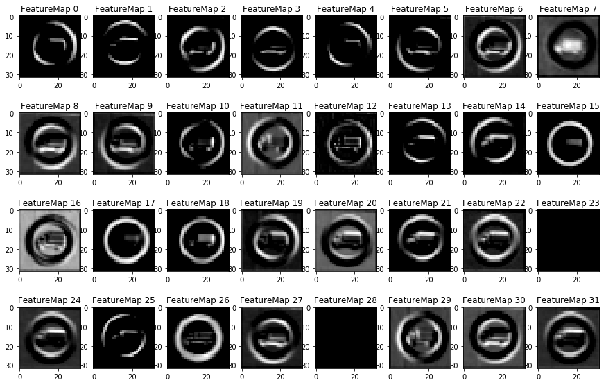
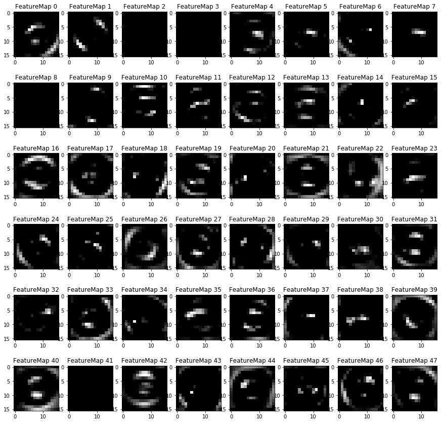
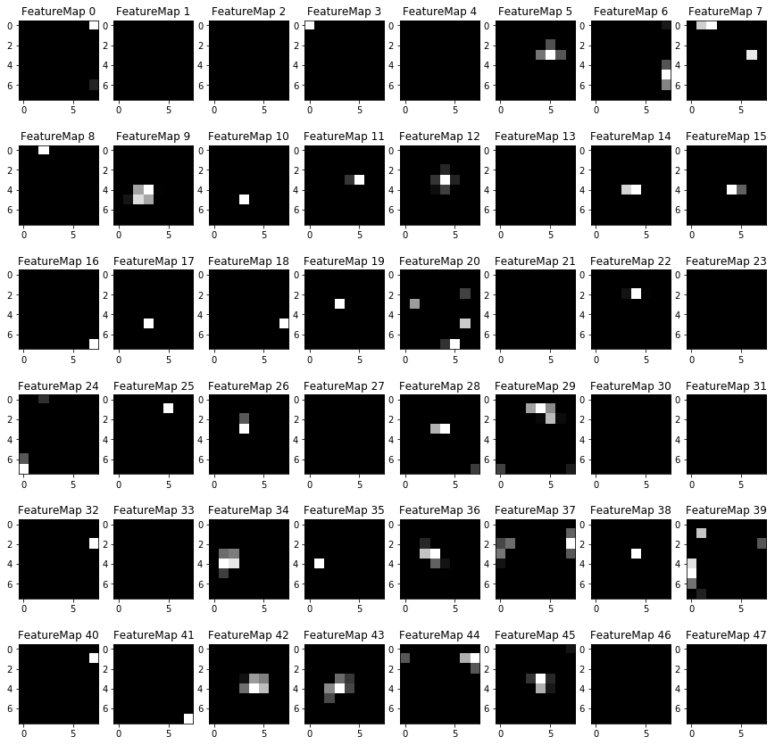

# Self-Driving Car Engineer Nanodegree

## Deep Learning

## Project: Build a Traffic Sign Recognition Classifier

In this notebook, a template is provided for you to implement your functionality in stages, which is required to successfully complete this project. If additional code is required that cannot be included in the notebook, be sure that the Python code is successfully imported and included in your submission if necessary. 

> **Note**: Once you have completed all of the code implementations, you need to finalize your work by exporting the iPython Notebook as an HTML document. Before exporting the notebook to html, all of the code cells need to have been run so that reviewers can see the final implementation and output. You can then export the notebook by using the menu above and navigating to  \n",
    "**File -> Download as -> HTML (.html)**. Include the finished document along with this notebook as your submission. 

In addition to implementing code, there is a writeup to complete. The writeup should be completed in a separate file, which can be either a markdown file or a pdf document. There is a [write up template](https://github.com/udacity/CarND-Traffic-Sign-Classifier-Project/blob/master/writeup_template.md) that can be used to guide the writing process. Completing the code template and writeup template will cover all of the [rubric points](https://review.udacity.com/#!/rubrics/481/view) for this project.

The [rubric](https://review.udacity.com/#!/rubrics/481/view) contains "Stand Out Suggestions" for enhancing the project beyond the minimum requirements. The stand out suggestions are optional. If you decide to pursue the "stand out suggestions", you can include the code in this Ipython notebook and also discuss the results in the writeup file.


>**Note:** Code and Markdown cells can be executed using the **Shift + Enter** keyboard shortcut. In addition, Markdown cells can be edited by typically double-clicking the cell to enter edit mode.

---
## Step 0: Load The Data


```python
# Load pickled data
import pickle

# TODO: Fill this in based on where you saved the training and testing data
training_file = r'traffic-signs-data\train.p'
validation_file= r'traffic-signs-data\valid.p'
testing_file = r'traffic-signs-data\test.p'

with open(training_file, mode='rb') as f:
    train = pickle.load(f)
with open(validation_file, mode='rb') as f:
    valid = pickle.load(f)
with open(testing_file, mode='rb') as f:
    test = pickle.load(f)
    
X_train, y_train = train['features'], train['labels']
X_valid, y_valid = valid['features'], valid['labels']
X_test, y_test = test['features'], test['labels']
```

---

## Step 1: Dataset Summary & Exploration

The pickled data is a dictionary with 4 key/value pairs:

- `'features'` is a 4D array containing raw pixel data of the traffic sign images, (num examples, width, height, channels).
- `'labels'` is a 1D array containing the label/class id of the traffic sign. The file `signnames.csv` contains id -> name mappings for each id.
- `'sizes'` is a list containing tuples, (width, height) representing the original width and height the image.
- `'coords'` is a list containing tuples, (x1, y1, x2, y2) representing coordinates of a bounding box around the sign in the image. **THESE COORDINATES ASSUME THE ORIGINAL IMAGE. THE PICKLED DATA CONTAINS RESIZED VERSIONS (32 by 32) OF THESE IMAGES**

Complete the basic data summary below. Use python, numpy and/or pandas methods to calculate the data summary rather than hard coding the results. For example, the [pandas shape method](http://pandas.pydata.org/pandas-docs/stable/generated/pandas.DataFrame.shape.html) might be useful for calculating some of the summary results. 

### Provide a Basic Summary of the Data Set Using Python, Numpy and/or Pandas


```python
### Replace each question mark with the appropriate value. 
### Use python, pandas or numpy methods rather than hard coding the results
import pandas as pd
import numpy as np

# TODO: Number of training examples
n_train = len(X_train)

# TODO: Number of validation examples
n_validation = len(X_valid)

# TODO: Number of testing examples.
n_test = len(X_test)

# TODO: What's the shape of an traffic sign image?
image_shape = X_train.shape

# TODO: How many unique classes/labels there are in the dataset.
sign_csv = pd.read_csv("signnames.csv")
signnames = sign_csv['SignName']
n_classes = len(sign_csv['ClassId'])

print("Number of training examples =", n_train)
print("Number of validating examples =", n_validation)
print("Number of testing examples =", n_test)
print("Image data shape =", image_shape)
print("Number of classes =", n_classes)
```

    Number of training examples = 34799
    Number of validating examples = 4410
    Number of testing examples = 12630
    Image data shape = (34799, 32, 32, 3)
    Number of classes = 43
    

### Include an exploratory visualization of the dataset

Visualize the German Traffic Signs Dataset using the pickled file(s). This is open ended, suggestions include: plotting traffic sign images, plotting the count of each sign, etc. 

The [Matplotlib](http://matplotlib.org/) [examples](http://matplotlib.org/examples/index.html) and [gallery](http://matplotlib.org/gallery.html) pages are a great resource for doing visualizations in Python.

**NOTE:** It's recommended you start with something simple first. If you wish to do more, come back to it after you've completed the rest of the sections. It can be interesting to look at the distribution of classes in the training, validation and test set. Is the distribution the same? Are there more examples of some classes than others?


```python
### Data exploration visualization code goes here.
### Feel free to use as many code cells as needed.
import matplotlib.pyplot as plt
# Visualizations will be shown in the notebook.
%matplotlib inline

def show_one_class_images(imags,labels,oneclass,defualtshowNUM = 10, withexample = True,cols = 10,cmap=None):
    """
    Random show one specified[oneclass] class image.
    
    Arguments:
        images: source images
        lables: source corresponding label 
        oneclass: class id[0-42]
        defualtshownum: maximum showing images per process
        cols: image showing column size
    """
    # check labal
    if oneclass >= n_classes:
        print('Out of range! The range is limited %d-%d !'%(0,(n_classes-1)))
        return
    
    # get one class images and numbers
    oneClassAllImages = imags[labels == oneclass]  # numpy bool index
    oneClassAllImageNUM = len(oneClassAllImages)
    
    # show images less than defualtshownum
    if oneClassAllImageNUM > defualtshowNUM:
        showimageNUM = defualtshowNUM
    else:
        showimageNUM = oneClassAllImageNUM
    
    # get show images rows
    rows = (showimageNUM + cols - 1)//cols
    
    print('Show Class = [%d],Name=[%s] from data set,Show length is [%d],Total length is [%d]'
          %(oneclass,signnames[oneclass],showimageNUM,oneClassAllImageNUM))
    
    exampleimage = plt.imread("resources/signs/%d.jpg"%(oneclass))
    
    plt.figure(figsize=(30,20))
    for i in range(showimageNUM):
        plt.subplot(rows, cols, i+1)
        if i==0 and withexample:
            showimage = exampleimage
        else:
            showimage = oneClassAllImages[np.random.randint(oneClassAllImageNUM)]
        
        showimage_shape = showimage.shape
        
        # use gray scale color map if only one channel
        if len(showimage_shape) == 2:
            cmap = 'gray'
        elif showimage_shape[2] == 1:
            showimage = showimage[:,:,0]
            cmap = 'gray'
        
        plt.imshow(showimage,cmap=cmap)
        plt.title(oneclass,fontsize=35,fontweight='bold')
        plt.xticks([])
        plt.yticks([])
    plt.tight_layout(pad=0,h_pad=0,w_pad=0)
    plt.show()
    
    
def show_all_classes_images(images, labels , sumclass = n_classes, cols = 10, cmap = None):
    """"
    Random show one image of all class from dataset.
    
    Arguments:
        images: source images
        lables: source corresponding label
        sumclass: sum class(42)
    """
    rows = (sumclass + cols -1)//cols
    
    print("Random show each class form data set:")
    
    plt.figure(figsize=(30,20))
    for i in range(sumclass):
        plt.subplot(rows, cols, i+1)
        oneclassimages = images[labels == i]  # numpy bool index
        showimage = oneclassimages[np.random.randint(len(oneclassimages))]
        showimage_shape = showimage.shape
        
        # use gray scale color map if only one channel
        if len(showimage_shape) == 2:
            cmap = 'gray'
        elif showimage_shape[2] == 1:
            showimage = showimage[:,:,0]
            cmap = 'gray'
        
        plt.imshow(showimage,cmap=cmap)
        plt.title(i,fontsize=45,fontweight='bold')
        plt.xticks([])
        plt.yticks([])
    plt.tight_layout(pad=0,h_pad=0,w_pad=0)
    plt.show()
    
def show_class_by_class_images(images, labels, classes=n_classes, cols = 10, cmap = None):
    """"
    Show all class by class from dataset.
    
    Arguments:
        images: source images
        lables: source corresponding label
        sumclass: sumary class(42)
    """
    for i in range(classes):
        show_one_class_images(images,labels,i,cols)
```

###  Randomly show special class iamges


```python
show_one_class_images(X_train,y_train,8)
```

    Show Class = [8],Name=[Speed limit (120km/h)] from data set,Show length is [10],Total length is [1260]
    


###  Randomly show all classes iamges


```python
show_all_classes_images(X_train,y_train)
```

    Random show each class form data set:
    





###  Randomly show class by class images


```python
# show_class_by_class_images(X_train,y_train)
```

# Show class images histogram function define


```python
def show_per_class_histogram(labels,sumclasses=n_classes):
    """
    show per class histogram
    
    Arguments:
        labels: source labels
        sumclasses: sum labels
    """
    hist, bins = np.histogram(labels, bins=sumclasses)
    width = 0.8 * (bins[1] - bins[0])
    center = (bins[:-1] + bins[1:]) / 1.96
    plt.figure(figsize=(15,5))
    plt.bar(center-width/2, hist, align='center', width=width)
    plt.title('Histogram of label frequency',fontsize=18,fontweight='bold')
    plt.xticks(np.arange(0,sumclasses,1))
    plt.xlabel('Classes')
    plt.ylabel('Frequency of each classes')
    plt.show()
    
def show_compared_histogram(y_train=y_train,y_test=y_test):
    train_classes = np.bincount(y_train)
    test_classes  = np.bincount(y_test)
    plt.figure(figsize=(15, 5))
    plt.bar(range(n_classes), train_classes, label="train", color="b", alpha=0.5)
    plt.bar(range(n_classes), test_classes,  label="test",  color="r", alpha=0.5)
    plt.xticks(np.arange(0,n_classes,1))
    plt.legend(loc="best")
    plt.title("Number of samples per class on the train and test dataset",fontsize=18,fontweight='bold')
    plt.show()
```

#### Show per class images frequency


```python
show_per_class_histogram(y_train)
```


#### Show per class on train and test set


```python
show_compared_histogram()
```


### Extend the images set

#### Define series preprocess function


```python
import cv2
from skimage.util import random_noise

def gamma_correction(image,gamma):
    """
    image Gamma Correction
    x: source img, array like
    gamma: >1 image darken; <1 image brighten
    """
    img = image/255.0
    img = cv2.pow(img,gamma) * 255.0
    # img = img.clip(0,255) # 不会超出范围，因为1的幂还是1
    return img.astype(np.uint8)

def gamma_image(image,gamma=0.5):
    """
    Radomly gamma correction gamma from 0.5-2.5
    """
    # 这里用到了HSV或者HSL的明度通道
    img_cvt = cv2.cvtColor(image,cv2.COLOR_RGB2HSV)
    img_cvt[:,:,2] = gamma_correction(img_cvt[:,:,2],2*np.random.sample(1)+gamma)
    return cv2.cvtColor(img_cvt, cv2.COLOR_HSV2RGB)
    
def gaussian_noise(img,mode='gaussian'):
    var = 0.001*np.random.random_sample(1)
    return np.uint8(255*random_noise(img/255.,mode=mode,var=var))
    
def projection_transform(image,hlimit=14,wlimit=14):
    """
    Randomly add projection on image
    
    """
    alpha = np.random.sample(1)
    img_shape = image.shape
    
    height = np.random.randint(0,hlimit)
    weight = np.random.randint(0,wlimit)
    row = np.random.randint(0,img_shape[0]-height) # 最底下进去一个高度，防止出界
    col = np.random.randint(0,img_shape[1]-weight) # 最右边减去一个宽度，防止出界
    result = np.copy(image)
    result[row:row+height,col:col+weight,0] = 127
    result[row:row+height,col:col+weight,1] = 127
    result[row:row+height,col:col+weight,2] = 127
    return cv2.addWeighted(image,1,result,alpha,0)


def extend_images_process(img):
    result = img
    if np.random.sample(1)<0.3:
        result = gamma_image(img)
        
    if np.random.sample(1)<0.2:
        result = projection_transform(img)
        
    if np.random.randint(1)<0.3:
        result = gaussian_noise(img)
        
    return result
```


```python
plt.imshow(X_train[8020])
```


    <matplotlib.image.AxesImage at 0x24225755048>


```python
plt.imshow(gaussian_noise(X_train[8020]))
```


    <matplotlib.image.AxesImage at 0x2421c402cf8>





#### images generator function


```python
from keras.preprocessing.image import ImageDataGenerator

datagen = ImageDataGenerator(rotation_range=5.,
                             shear_range=0.2,
                             zoom_range=0.2,
                             channel_shift_range=0.5,
                             width_shift_range=0.15,
                             height_shift_range=0.15,
                             preprocessing_function=extend_images_process) # preprocessing_function=extend_images_process

def gen_class_images_show(X_data,y_data,x_class):
    images = np.copy(X_data[y_data==x_class])
    labels = np.copy(y_data[y_data==x_class])
    img = images[np.random.randint(len(images))]
    plt.figure(figsize=(2,2))
    plt.imshow(img)
    plt.title('Source image: Class = {}'.format(x_class))
    #plt.axis('off')
    plt.xticks([])
    plt.yticks([])
    plt.show()
    
    X_gen = np.empty((0,img.shape[0],img.shape[1],img.shape[2]),dtype=np.uint8)
    y_gen = np.empty(0,dtype=np.uint8)
    
    print("Generating images... Class = {}".format(x_class))
    batch_size = 20
    for X_batch, y_batch in datagen.flow(images,labels,batch_size=30):
        # NOTE: X_batch is float, need to covert to uint8
        X_gen = np.concatenate((X_gen,X_batch.astype(np.uint8)),axis=0) # 沿着row追加
        y_gen = np.concatenate((y_gen,y_batch),axis=0)
        break # 产生一次即可
    
    show_one_class_images(X_gen,y_gen,x_class,batch_size,withexample=False)
```


```python
gen_class_images_show(X_train,y_train,24)
```


    Generating images... Class = 24
    Show Class = [24],Name=[Road narrows on the right] from data set,Show length is [20],Total length is [30]
    


#### images data merge


```python
X_train = np.concatenate((X_train, X_valid), axis=0)
y_train = np.concatenate((y_train, y_valid), axis=0)
```

### Generator All class images to balace data


```python
def gen_class_images(X_data, y_data,sumclass=n_classes, min_samples=6000, batch_size=128):
    for x_class in range(sumclass):
        print("Class {:>2}".format(x_class)," : ",end="")
        images = X_data[y_data==x_class]
        labels = y_data[y_data==x_class]
        
        num = len(images)
        print("{:>4}".format(num),end="")
        
        to_gen_num = min_samples - num # 除了原始数据以外需要生成的样本数
        
        # Generate images,for循环里面，图片数量不能满足多轮batch_size的次数，所以要加while再次循环
        while(to_gen_num >= 0):
            for X_batch,y_batch in datagen.flow(images,labels,batch_size):
                X_data = np.concatenate((X_data,X_batch.astype(np.uint8)),axis=0)
                y_data = np.concatenate((y_data,y_batch),axis=0)
                
                to_gen_num -= batch_size
                if to_gen_num < 0:
                    break
            
            num = len(X_data[y_data==x_class])
            to_gen_num = min_samples - num
        print(", Generated samples numbers = {:>4}".format(num))
    print("Generate images data has completed!")
    return X_data,y_data      
```


```python
X_train,y_train = gen_class_images(X_train,y_train)
```

    Class  0  :  210, Generated samples numbers = 6008
    Class  1  : 2220, Generated samples numbers = 6104
    Class  2  : 2250, Generated samples numbers = 6036
    Class  3  : 1410, Generated samples numbers = 6024
    Class  4  : 1980, Generated samples numbers = 6068
    Class  5  : 1860, Generated samples numbers = 6092
    Class  6  :  420, Generated samples numbers = 6008
    Class  7  : 1440, Generated samples numbers = 6016
    Class  8  : 1410, Generated samples numbers = 6024
    Class  9  : 1470, Generated samples numbers = 6008
    Class 10  : 2010, Generated samples numbers = 6030
    Class 11  : 1320, Generated samples numbers = 6048
    Class 12  : 2100, Generated samples numbers = 6120
    Class 13  : 2160, Generated samples numbers = 6112
    Class 14  :  780, Generated samples numbers = 6088
    Class 15  :  630, Generated samples numbers = 6054
    Class 16  :  420, Generated samples numbers = 6008
    Class 17  : 1110, Generated samples numbers = 6062
    Class 18  : 1200, Generated samples numbers = 6080
    Class 19  :  210, Generated samples numbers = 6008
    Class 20  :  360, Generated samples numbers = 6016
    Class 21  :  330, Generated samples numbers = 6068
    Class 22  :  390, Generated samples numbers = 6100
    Class 23  :  510, Generated samples numbers = 6122
    Class 24  :  270, Generated samples numbers = 6054
    Class 25  : 1500, Generated samples numbers = 6128
    Class 26  :  600, Generated samples numbers = 6040
    Class 27  :  240, Generated samples numbers = 6128
    Class 28  :  540, Generated samples numbers = 6040
    Class 29  :  270, Generated samples numbers = 6054
    Class 30  :  450, Generated samples numbers = 6106
    Class 31  :  780, Generated samples numbers = 6088
    Class 32  :  240, Generated samples numbers = 6128
    Class 33  :  689, Generated samples numbers = 6024
    Class 34  :  420, Generated samples numbers = 6008
    Class 35  : 1200, Generated samples numbers = 6080
    Class 36  :  390, Generated samples numbers = 6100
    Class 37  :  210, Generated samples numbers = 6008
    Class 38  : 2070, Generated samples numbers = 6060
    Class 39  :  300, Generated samples numbers = 6084
    Class 40  :  360, Generated samples numbers = 6016
    Class 41  :  240, Generated samples numbers = 6128
    Class 42  :  240, Generated samples numbers = 6128
    Generate images data has completed!
    

#### Save generated image data


```python
import pickle
gen_data_file = "traffic-signs-data/gen_data.p"
print("Generated iamges numbers = {}".format(len(X_train)))
pickle.dump({"images":X_train,"labels":y_train},open(gen_data_file,"wb"),protocol=4)
print("Generated images data has saved completly!")
```

    Generated iamges numbers = 43619
    Generated images data has saved completly!
    

#### Restore generated image data


```python
with open("traffic-signs-data/gen_data.p","rb") as f:
    image_data = pickle.load(f)

X_train,y_train = image_data["images"],image_data["labels"]
```

#### Split generated image data into train and valid set


```python
from sklearn.model_selection import train_test_split
X_train,X_valid,y_train,y_valid = train_test_split(X_train,y_train,test_size=0.2,random_state=42)
show_compared_histogram(y_train,y_valid)
```


----

## Step 2: Design and Test a Model Architecture

Design and implement a deep learning model that learns to recognize traffic signs. Train and test your model on the [German Traffic Sign Dataset](http://benchmark.ini.rub.de/?section=gtsrb&subsection=dataset).

The LeNet-5 implementation shown in the [classroom](https://classroom.udacity.com/nanodegrees/nd013/parts/fbf77062-5703-404e-b60c-95b78b2f3f9e/modules/6df7ae49-c61c-4bb2-a23e-6527e69209ec/lessons/601ae704-1035-4287-8b11-e2c2716217ad/concepts/d4aca031-508f-4e0b-b493-e7b706120f81) at the end of the CNN lesson is a solid starting point. You'll have to change the number of classes and possibly the preprocessing, but aside from that it's plug and play! 

With the LeNet-5 solution from the lecture, you should expect a validation set accuracy of about 0.89. To meet specifications, the validation set accuracy will need to be at least 0.93. It is possible to get an even higher accuracy, but 0.93 is the minimum for a successful project submission. 

There are various aspects to consider when thinking about this problem:

- Neural network architecture (is the network over or underfitting?)
- Play around preprocessing techniques (normalization, rgb to grayscale, etc)
- Number of examples per label (some have more than others).
- Generate fake data.

Here is an example of a [published baseline model on this problem](http://yann.lecun.com/exdb/publis/pdf/sermanet-ijcnn-11.pdf). It's not required to be familiar with the approach used in the paper but, it's good practice to try to read papers like these.

### Pre-process the Data Set (normalization, grayscale, etc.)

Minimally, the image data should be normalized so that the data has mean zero and equal variance. For image data, `(pixel - 128)/ 128` is a quick way to approximately normalize the data and can be used in this project. 

Other pre-processing steps are optional. You can try different techniques to see if it improves performance. 

Use the code cell (or multiple code cells, if necessary) to implement the first step of your project.


```python
### Preprocess the data here. It is required to normalize the data. Other preprocessing steps could include 
### converting to grayscale, etc.
### Feel free to use as many code cells as needed.
def normalize_img(img):
    """
    Normalize image data to [-1,+1]
    
    Arguments:
        img: source image
    """
    return (img-128.)/128.

```

#### Normalize image data & shuffle train data


```python
X_train_normalized = normalize_img(X_train)
X_valid_normalized = normalize_img(X_valid)
X_test_normalized = normalize_img(X_test)
```

### Model Architecture


```python
### Define your architecture here.
### Feel free to use as many code cells as needed.

import tensorflow as tf

def model(x):
    """
    Model Architecture
    
    Arguments:
        x: 4-D Tensor [batch, in_height, in_width, in_channels]
    Returns:
        logits: 1x43 tensor
        keep_prob1: float placeholder
        keep_prob2: float placeholder
        keep_prob3: float placeholder
    """
    # Arguments used for tf.truncated_normal, randomly defines variables for the weights and biases for each layer
    mu = 0
    sigma = 0.05
    
    keep_prob1 = tf.placeholder(tf.float32)
    keep_prob2 = tf.placeholder(tf.float32)
    keep_prob3 = tf.placeholder(tf.float32)
    
    # Block 1
    # Layer 1: Convolutional. Input = 32x32x3. Output = 32x32x32
    conv1_W = tf.Variable(tf.truncated_normal(shape=(3,3,3,32), mean=mu, stddev=sigma), name='conv1_W') # filter: 32  3x3x3 
    conv1_b = tf.Variable(tf.zeros(32), name='conv1_b')
    conv1 = tf.nn.conv2d(x, conv1_W, strides=[1,1,1,1], padding='SAME') + conv1_b
    
    # Activation
    conv1 = tf.nn.relu(conv1, name="conv1_activation")
    
    # Layer 2: Convolutional. Input = 32x32x32. Output = 32x32x32
    conv2_W = tf.Variable(tf.truncated_normal(shape=(3,3,32,32), mean=mu, stddev=sigma), name='conv2_W') # filter: 32   3x3x32 
    conv2_b = tf.Variable(tf.zeros(32), name='conv2_b')
    conv2 = tf.nn.conv2d(conv1, conv2_W, strides=[1,1,1,1], padding='SAME') + conv2_b
    
    # Activation
    conv2 = tf.nn.relu(conv2, name="conv2_activation")
    
    # Pooling. Input = 32x32x32. Output = 16x16x32
    conv2 = tf.nn.max_pool(conv2, ksize=[1, 2, 2, 1], strides=[1, 2, 2, 1], padding='VALID')
    
    conv2 = tf.nn.dropout(conv2, keep_prob1)
    
    # Block 2
    # Layer 3: Convolutional. Input = 16x16x32. Output = 16x16x64
    conv3_W = tf.Variable(tf.truncated_normal(shape=(3,3,32,64), mean=mu, stddev=sigma), name='conv3_W') # filter: 64  3x3x32 
    conv3_b = tf.Variable(tf.zeros(64), name='conv3_b')
    conv3 = tf.nn.conv2d(conv2, conv3_W, strides=[1,1,1,1], padding='SAME') + conv3_b
    
    # Activation
    conv3 = tf.nn.relu(conv3,name="conv3_activation")
    
    # Layer 4: Convolutional. Input = 16x16x64. Output = 16x16x64
    conv4_W = tf.Variable(tf.truncated_normal(shape=(3,3,64,64), mean=mu, stddev=sigma), name='conv4_W') # filter: 64   3x3x64 
    conv4_b = tf.Variable(tf.zeros(64), name='conv4_b')
    conv4 = tf.nn.conv2d(conv3, conv4_W, strides=[1,1,1,1], padding='SAME') + conv4_b
    
    # Activation
    conv4 = tf.nn.relu(conv4,name="conv4_activation")
    
    # Pooling. Input = 16x16x64. Output = 8x8x64
    conv4 = tf.nn.max_pool(conv4, ksize=[1, 2, 2, 1], strides=[1, 2, 2, 1], padding='VALID')
    
    conv4 = tf.nn.dropout(conv4, keep_prob1)
    
    # Block 3
    # Layer 5: Convolutional. Input = 8x8x64. Output = 8x8x128
    conv5_W = tf.Variable(tf.truncated_normal(shape=(3,3,64,128), mean=mu, stddev=sigma), name='conv5_W') # filter: 128 3x3x64
    conv5_b = tf.Variable(tf.zeros(128), name='conv5_b')
    conv5 = tf.nn.conv2d(conv4, conv5_W, strides=[1,1,1,1], padding="SAME") + conv5_b
    
    # Activation
    conv5 = tf.nn.relu(conv5, name="conv5_activation")
    
    # Layer 6: Convolutional. Input = 8x8x128. Output = 8x8x128
    conv6_W = tf.Variable(tf.truncated_normal(shape=(3,3,128,128), mean=mu, stddev=sigma), name='conv6_W')  # filter: 128   3x3x128
    conv6_b = tf.Variable(tf.zeros(128), name='conv6_b')
    conv6 = tf.nn.conv2d(conv5, conv6_W, strides=[1,1,1,1], padding='SAME') + conv6_b
    
    # Activation
    conv6 = tf.nn.relu(conv6, name="conv6_activation")
    
    # Pooling : Input = 8x8x128. Output = 4x4x128
    conv6 = tf.nn.max_pool(conv6, ksize=[1,2,2,1], strides=[1,2,2,1], padding='VALID')
    
    conv6 = tf.nn.dropout(conv6, keep_prob1)
    
    
    # Flatten: Input = 4x4x128. Output = 2048
    fc0 = tf.contrib.layers.flatten(conv6)
    
    # Block 4
    # Fully Connected Layer1: Input = 2048. Output = 2048
    fc1_W = tf.Variable(tf.truncated_normal(shape=(2048,2048), mean=mu, stddev=sigma), name='fc1_W')
    fc1_b = tf.Variable(tf.zeros(2048), name='fc1_b')
    fc1 = tf.matmul(fc0, fc1_W) + fc1_b
    
    # Activation
    fc1 = tf.nn.relu(fc1)
    
    fc1 = tf.nn.dropout(fc1, keep_prob2)
    
    # Fully Connected Layer2: Input = 2048. Output = 2048
    fc2_W = tf.Variable(tf.truncated_normal(shape=(2048,2048), mean=mu, stddev=sigma), name='fc2_W')
    fc2_b = tf.Variable(tf.zeros(2048))
    fc2 = tf.matmul(fc1, fc2_W) + fc2_b
    
    # Activation
    fc2 = tf.nn.relu(fc2)
    
    fc2 = tf.nn.dropout(fc2, keep_prob3)
    
    # Fully Connected Layers3: Input = 2048. Output = 43
    fc3_W = tf.Variable(tf.truncated_normal(shape=(2048,43), mean=mu, stddev=sigma), name='fc3_W')
    fc3_b = tf.Variable(tf.zeros(43))
    logits = tf.matmul(fc2, fc3_W) + fc3_b
    
    # Regularization is very importance improve performance
    regularization = tf.nn.l2_loss(conv1_W)+tf.nn.l2_loss(conv2_W)+tf.nn.l2_loss(conv3_W)+tf.nn.l2_loss(conv4_W)+tf.nn.l2_loss(conv5_W)+tf.nn.l2_loss(conv6_W)+tf.nn.l2_loss(fc1_W)+tf.nn.l2_loss(fc2_W)+tf.nn.l2_loss(fc3_W)
    
    return logits,regularization, keep_prob1, keep_prob2, keep_prob3  
```

### Train, Validate and Test the Model

A validation set can be used to assess how well the model is performing. A low accuracy on the training and validation
sets imply underfitting. A high accuracy on the training set but low accuracy on the validation set implies overfitting.


```python
### Train your model here.
### Calculate and report the accuracy on the training and validation set.
### Once a final model architecture is selected, 
### the accuracy on the test set should be calculated and reported as well.
### Feel free to use as many code cells as needed.


# -*- coding=UTF-8 -*-

# Features and Labels
x = tf.placeholder(tf.float32, (None, 32, 32, 3))
y = tf.placeholder(tf.int32, (None))
one_hot_y = tf.one_hot(y, 43) # 这里要用独热编码，因为如果真实的标签是20，预测是10，两者之差10，惩罚太重了

# Training Pipeline (Loss Fucntion)
logits,loss_regularization, keep_prob1, keep_prob2, keep_prob3 = model(x)
cross_entropy = tf.nn.softmax_cross_entropy_with_logits(labels=one_hot_y, logits=logits)

# loss_operation = tf.reduce_mean(cross_entropy + loss_rate*loss_regularization)
# optimizer = tf.train.AdamOptimizer(learning_rate = learning_rate)
# training_operation = optimizer.minimize(loss_operation)

# Model Evaluation
#这里纯计算预测值是否与真实值一致，一致为真，不一致为假；若需要输出预测概率需用tf.nn.softmax(logits)
correct_prediction = tf.equal(tf.argmax(logits, 1), tf.argmax(one_hot_y, 1)) # tf.argmax(logits, 1) return max value index of per col
accuracy_operation = tf.reduce_mean(tf.cast(correct_prediction, tf.float32))

def evaluate(X_data, y_data, BATCH_SIZE):
    num_examples = len(X_data)
    total_accuracy = 0
    sess = tf.get_default_session()
    for offset in range(0, num_examples, BATCH_SIZE):
        batch_x, batch_y = X_data[offset:offset+BATCH_SIZE], y_data[offset:offset+BATCH_SIZE]
        
        # NOTE: Here should ban dropout, becouse model has trained completely
        accuracy = sess.run(accuracy_operation, feed_dict={x: batch_x, y: batch_y,keep_prob1:1.0, keep_prob2:1.0, keep_prob3:1.0})
        
        total_accuracy += (accuracy * len(batch_x))
    return total_accuracy / num_examples
```

####  Define mode function


```python
from sklearn.utils import shuffle
saver = tf.train.Saver()

learning_rate = 0.0005
loss_rate = 0.0001
loss_operation = tf.reduce_mean(cross_entropy + loss_rate*loss_regularization)
optimizer = tf.train.AdamOptimizer(learning_rate = learning_rate)
training_operation = optimizer.minimize(loss_operation)

def trainmodel(X_train=X_train, y_train=y_train,X_valid=X_valid, y_valid=y_valid, epochs=80, batch_size=128, start_log_epoch=8,epoch_tolerance=10):
    """
    Train mode
    
    Arguments:
        X_train: source image data
        y_train: source iamge data corresponding labels
        X_valid: valid image data
        y_valid: valid iamge data corrdsponding labels
        epochs: the number of epoch
        batch_size: take image num
        start_log_epoch: 开始记录性能提升
        epoch_tolerance: 多少轮以后准确率没提升
    """
    best_validation_accuracy = 0.0
    last_improved_epoch = start_log_epoch
    
    if start_log_epoch > epochs:
        print("Epochs numbers {:>2} should greater than start_log_epoch {:>2}".format(epochs,start_log_epoch))
        return
    
    with tf.Session() as sess:
        sess.run(tf.global_variables_initializer())
        num_examples = len(X_train)
        
        print("Training...")
        print()
        for i in range(epochs):
            X_train, y_train = shuffle(X_train, y_train)
            
            # Training
            for offset in range(0, num_examples, batch_size):
                end = offset + batch_size
                batch_x, batch_y = X_train[offset:end], y_train[offset:end]
                sess.run(training_operation, feed_dict={x: batch_x, y: batch_y,keep_prob1:0.9, keep_prob2:0.8, keep_prob3:0.5})

            # Evaluate on train set and valid set
            train_accuracy = evaluate(X_train, y_train, batch_size)
            print("EPOCH {:>2} ...".format(i+1), end=' ')
            print("Train Accuracy = {:.4f}".format(train_accuracy), end='  ')
            
            validation_accuracy = evaluate(X_valid, y_valid, batch_size)
            print("Validation Accuracy = {:.4f}".format(validation_accuracy))
            
            if i > start_log_epoch and validation_accuracy > best_validation_accuracy:
                # updata the best-known validation accuracy
                best_validation_accuracy = validation_accuracy
                print("Current Best Validation Accuracy = {:.4f} has saved completely!".format(best_validation_accuracy))
                
                # Record the last validation accuracy improve epoch
                last_improved_epoch = i
                
                # Save all parameters to file
                saver.save(sess, './model/')
            
            if i - last_improved_epoch > epoch_tolerance:
                print("{} epochs have no improvement after the best validation accuracy = {:.4f}".format(epoch_tolerance,best_validation_accuracy))
                
                # Jump out the loop
                break
                

        # saver.save(sess, './model/')
        # print("Model saved")
        print("Best Accuracy = {:.4f} Model has saved!".format(best_validation_accuracy))
```

#### train mode


```python
trainmodel(X_train_normalized, y_train,X_valid_normalized, y_valid)
```

    Training...
    
    EPOCH  1 ... Train Accuracy = 0.9706  Validation Accuracy = 0.9650
    EPOCH  2 ... Train Accuracy = 0.9903  Validation Accuracy = 0.9856
    EPOCH  3 ... Train Accuracy = 0.9912  Validation Accuracy = 0.9873
    EPOCH  4 ... Train Accuracy = 0.9907  Validation Accuracy = 0.9870
    EPOCH  5 ... Train Accuracy = 0.9924  Validation Accuracy = 0.9893
    EPOCH  6 ... Train Accuracy = 0.9963  Validation Accuracy = 0.9933
    EPOCH  7 ... Train Accuracy = 0.9971  Validation Accuracy = 0.9943
    EPOCH  8 ... Train Accuracy = 0.9979  Validation Accuracy = 0.9952
    EPOCH  9 ... Train Accuracy = 0.9975  Validation Accuracy = 0.9953
    EPOCH 10 ... Train Accuracy = 0.9956  Validation Accuracy = 0.9927
    Current Best Validation Accuracy = 0.9927 has saved completely!
    EPOCH 11 ... Train Accuracy = 0.9975  Validation Accuracy = 0.9955
    Current Best Validation Accuracy = 0.9955 has saved completely!
    EPOCH 12 ... Train Accuracy = 0.9969  Validation Accuracy = 0.9940
    EPOCH 13 ... Train Accuracy = 0.9988  Validation Accuracy = 0.9963
    Current Best Validation Accuracy = 0.9963 has saved completely!
    EPOCH 14 ... Train Accuracy = 0.9989  Validation Accuracy = 0.9972
    Current Best Validation Accuracy = 0.9972 has saved completely!
    EPOCH 15 ... Train Accuracy = 0.9986  Validation Accuracy = 0.9967
    EPOCH 16 ... Train Accuracy = 0.9982  Validation Accuracy = 0.9961
    EPOCH 17 ... Train Accuracy = 0.9987  Validation Accuracy = 0.9969
    EPOCH 18 ... Train Accuracy = 0.9978  Validation Accuracy = 0.9951
    EPOCH 19 ... Train Accuracy = 0.9988  Validation Accuracy = 0.9967
    EPOCH 20 ... Train Accuracy = 0.9989  Validation Accuracy = 0.9968
    EPOCH 21 ... Train Accuracy = 0.9993  Validation Accuracy = 0.9974
    Current Best Validation Accuracy = 0.9974 has saved completely!
    EPOCH 22 ... Train Accuracy = 0.9987  Validation Accuracy = 0.9966
    EPOCH 23 ... Train Accuracy = 0.9993  Validation Accuracy = 0.9974
    EPOCH 24 ... Train Accuracy = 0.9962  Validation Accuracy = 0.9938
    EPOCH 25 ... Train Accuracy = 0.9990  Validation Accuracy = 0.9974
    EPOCH 26 ... Train Accuracy = 0.9980  Validation Accuracy = 0.9961
    EPOCH 27 ... Train Accuracy = 0.9987  Validation Accuracy = 0.9969
    EPOCH 28 ... Train Accuracy = 0.9990  Validation Accuracy = 0.9968
    EPOCH 29 ... Train Accuracy = 0.9986  Validation Accuracy = 0.9965
    EPOCH 30 ... Train Accuracy = 0.9985  Validation Accuracy = 0.9962
    EPOCH 31 ... Train Accuracy = 0.9994  Validation Accuracy = 0.9980
    Current Best Validation Accuracy = 0.9980 has saved completely!
    EPOCH 32 ... Train Accuracy = 0.9995  Validation Accuracy = 0.9976
    EPOCH 33 ... Train Accuracy = 0.9993  Validation Accuracy = 0.9974
    EPOCH 34 ... Train Accuracy = 0.9982  Validation Accuracy = 0.9956
    EPOCH 35 ... Train Accuracy = 0.9991  Validation Accuracy = 0.9972
    EPOCH 36 ... Train Accuracy = 0.9995  Validation Accuracy = 0.9976
    EPOCH 37 ... Train Accuracy = 0.9996  Validation Accuracy = 0.9977
    EPOCH 38 ... Train Accuracy = 0.9994  Validation Accuracy = 0.9979
    EPOCH 39 ... Train Accuracy = 0.9997  Validation Accuracy = 0.9981
    Current Best Validation Accuracy = 0.9981 has saved completely!
    EPOCH 40 ... Train Accuracy = 0.9994  Validation Accuracy = 0.9977
    EPOCH 41 ... Train Accuracy = 0.9986  Validation Accuracy = 0.9965
    EPOCH 42 ... Train Accuracy = 0.9996  Validation Accuracy = 0.9977
    EPOCH 43 ... Train Accuracy = 0.9994  Validation Accuracy = 0.9972
    EPOCH 44 ... Train Accuracy = 0.9985  Validation Accuracy = 0.9961
    EPOCH 45 ... Train Accuracy = 0.9993  Validation Accuracy = 0.9978
    EPOCH 46 ... Train Accuracy = 0.9962  Validation Accuracy = 0.9941
    EPOCH 47 ... Train Accuracy = 0.9995  Validation Accuracy = 0.9982
    Current Best Validation Accuracy = 0.9982 has saved completely!
    EPOCH 48 ... Train Accuracy = 0.9998  Validation Accuracy = 0.9984
    Current Best Validation Accuracy = 0.9984 has saved completely!
    EPOCH 49 ... Train Accuracy = 0.9991  Validation Accuracy = 0.9965
    EPOCH 50 ... Train Accuracy = 0.9995  Validation Accuracy = 0.9978
    EPOCH 51 ... Train Accuracy = 0.9994  Validation Accuracy = 0.9977
    EPOCH 52 ... Train Accuracy = 0.9991  Validation Accuracy = 0.9972
    EPOCH 53 ... Train Accuracy = 0.9996  Validation Accuracy = 0.9980
    EPOCH 54 ... Train Accuracy = 0.9988  Validation Accuracy = 0.9970
    EPOCH 55 ... Train Accuracy = 0.9997  Validation Accuracy = 0.9984
    EPOCH 56 ... Train Accuracy = 0.9996  Validation Accuracy = 0.9979
    EPOCH 57 ... Train Accuracy = 0.9995  Validation Accuracy = 0.9980
    EPOCH 58 ... Train Accuracy = 0.9988  Validation Accuracy = 0.9967
    EPOCH 59 ... Train Accuracy = 0.9995  Validation Accuracy = 0.9978
    10 epochs have no improvement after the best validation accuracy = 0.9984
    Best Accuracy = 0.9984 Model has saved!
    

#### FineTune modle


```python
learning_rate = 0.0001
loss_rate = 0.0001
loss_operation = tf.reduce_mean(cross_entropy + loss_rate*loss_regularization)
optimizer = tf.train.AdamOptimizer(learning_rate = learning_rate)
training_operation = optimizer.minimize(loss_operation)

def finetune(X_train=X_train, y_train=y_train,X_valid=X_valid, y_valid=y_valid, epochs=80, batch_size=128, start_log_epoch=3,epoch_tolerance=10):
    """
    Fine tune the retrained model
    """
    best_validation_accuracy = 0.0
    last_improved_epoch = start_log_epoch
    
    if start_log_epoch > epochs:
        print("Epochs numbers {:>2} should greater than start_log_epoch {:>2}".format(epochs,start_log_epoch))
        return
    
    with tf.Session() as sess:
        sess.run(tf.global_variables_initializer())
        saver.restore(sess, './model/')
        num_examples = len(X_train)
        
        print("Training...")
        print()
        for i in range(epochs):
            X_train, y_train = shuffle(X_train, y_train)
            
            # Training
            for offset in range(0, num_examples, batch_size):
                end = offset + batch_size
                batch_x, batch_y = X_train[offset:end], y_train[offset:end]
                sess.run(training_operation, feed_dict={x: batch_x, y: batch_y,keep_prob1:0.9, keep_prob2:0.75, keep_prob3:0.5})

            # Evaluate on train set and valid set
            train_accuracy = evaluate(X_train, y_train, batch_size)
            print("EPOCH {:>2} ...".format(i+1), end=' ')
            print("Train Accuracy = {:.4f}".format(train_accuracy), end='  ')
            
            validation_accuracy = evaluate(X_valid, y_valid, batch_size)
            print("Validation Accuracy = {:.4f}".format(validation_accuracy))
            
            if i > start_log_epoch and validation_accuracy > best_validation_accuracy:
                # updata the best-known validation accuracy
                best_validation_accuracy = validation_accuracy
                print("Current Best Validation Accuracy = {:.4f} has saved completely!".format(best_validation_accuracy))
                
                # Record the last validation accuracy improve epoch
                last_improved_epoch = i
                
                # Save all parameters to file
                saver.save(sess, './model/')
            
            if i - last_improved_epoch > epoch_tolerance:
                print("{:>2} epochs have no improvement after the best validation accuracy = {:.4f}".format(epoch_tolerance,best_validation_accuracy))
                
                # Jump out the loop
                break
                

        # saver.save(sess, './model/')
        # print("Model saved")
        print("Best Accuracy = {:.4f} Model has saved!".format(best_validation_accuracy))
```


```python
finetune(X_train_normalized, y_train,X_valid_normalized, y_valid)
```

    INFO:tensorflow:Restoring parameters from ./model/
    Training...
    
    EPOCH  1 ... Train Accuracy = 1.0000  Validation Accuracy = 0.9989
    EPOCH  2 ... Train Accuracy = 1.0000  Validation Accuracy = 0.9987
    EPOCH  3 ... Train Accuracy = 1.0000  Validation Accuracy = 0.9990
    EPOCH  4 ... Train Accuracy = 1.0000  Validation Accuracy = 0.9988
    EPOCH  5 ... Train Accuracy = 1.0000  Validation Accuracy = 0.9989
    Current Best Validation Accuracy = 0.9989 has saved completely!
    EPOCH  6 ... Train Accuracy = 1.0000  Validation Accuracy = 0.9989
    EPOCH  7 ... Train Accuracy = 1.0000  Validation Accuracy = 0.9990
    Current Best Validation Accuracy = 0.9990 has saved completely!
    EPOCH  8 ... Train Accuracy = 1.0000  Validation Accuracy = 0.9988
    EPOCH  9 ... Train Accuracy = 0.9999  Validation Accuracy = 0.9987
    EPOCH 10 ... Train Accuracy = 1.0000  Validation Accuracy = 0.9991
    Current Best Validation Accuracy = 0.9991 has saved completely!
    EPOCH 11 ... Train Accuracy = 1.0000  Validation Accuracy = 0.9992
    Current Best Validation Accuracy = 0.9992 has saved completely!
    EPOCH 12 ... Train Accuracy = 1.0000  Validation Accuracy = 0.9988
    EPOCH 13 ... Train Accuracy = 1.0000  Validation Accuracy = 0.9991
    EPOCH 14 ... Train Accuracy = 1.0000  Validation Accuracy = 0.9991
    EPOCH 15 ... Train Accuracy = 1.0000  Validation Accuracy = 0.9989
    EPOCH 16 ... Train Accuracy = 1.0000  Validation Accuracy = 0.9990
    EPOCH 17 ... Train Accuracy = 1.0000  Validation Accuracy = 0.9987
    EPOCH 18 ... Train Accuracy = 1.0000  Validation Accuracy = 0.9991
    EPOCH 19 ... Train Accuracy = 0.9999  Validation Accuracy = 0.9986
    EPOCH 20 ... Train Accuracy = 0.9999  Validation Accuracy = 0.9987
    EPOCH 21 ... Train Accuracy = 1.0000  Validation Accuracy = 0.9989
    EPOCH 22 ... Train Accuracy = 1.0000  Validation Accuracy = 0.9990
    10 epochs have no improvement after the best validation accuracy = 0.9992
    Best Accuracy = 0.9992 Model has saved!
    

#### Test mode on test data set


```python
def testdata(X_data, y_labels, BATCH_SIZE=128):
    with tf.Session() as sess:
        saver.restore(sess, './model/')
        test_accuracy = evaluate(X_data, y_labels, BATCH_SIZE)
        print("Test Accuracy = {:.4f}".format(test_accuracy))
```


```python
testdata(X_test_normalized,y_test)
```

    INFO:tensorflow:Restoring parameters from ./model/
    Test Accuracy = 0.9846
    

## Analysis Error Images


```python
def predict(X_data,y_data,logits=logits,BATCH_SIZE=128):
    """
    Predict Labels
    
    Arguments:
        X_data: source images
        y_data: source images corresponding lables
        logits: tensor
    """
    y_softmax = tf.nn.softmax(logits=logits)
    y_predict = tf.argmax(y_softmax,axis=1)
    num = len(X_data)
    labels = []
    with tf.Session() as sess:
        saver.restore(sess, './model/')
        for offset in range(0,num,BATCH_SIZE):
            batch_x, batch_y = X_data[offset:offset+BATCH_SIZE], y_data[offset:offset+BATCH_SIZE]
            label = sess.run(y_predict,feed_dict={x:batch_x,y:batch_y,keep_prob1:1.0,keep_prob2:1.0,keep_prob3:1.0})
            labels.extend(label)
    return np.array(labels)
```


```python
preditlables = predict(X_test_normalized,y_test)
```

    INFO:tensorflow:Restoring parameters from ./model/
    


```python
def show_all_images(images,labels,cmap=None):
    """
    Show all images and corresponding labels
    Arguments:
        images: source iamges
        labels: source iamges corresponding labels
    """
    cols = 15
    num = len(images)
    rows = (num + cols -1)//cols
    
    plt.figure(figsize=(15,5))
    for i in range(num):
        plt.subplot(rows,cols,i+1)
        image = images[i]
        image_shape = image.shape
        
        if len(image_shape) == 2:
            cmap = 'gray'
        elif image_shape[2] == 1:
            image = image[:,:,0]
            cmap = 'gray'
            
        plt.imshow(image,cmap=cmap)
        plt.title(labels[i],fontsize=15,fontweight='bold')
        plt.xticks([])
        plt.yticks([])
    plt.tight_layout(pad=0, h_pad=0, w_pad=0)
    plt.show()          
```


```python
error_x = X_test[y_test != preditlables][:60]
error_y = y_test[y_test != preditlables][:60]
print("The number of incorrectly predict labels is {}".format(len(y_test[y_test != preditlables])))
show_all_images(error_x,error_y)
```

    The number of incorrectly predict labels is 194
    


---

## Step 3: Test a Model on New Images

To give yourself more insight into how your model is working, download at least five pictures of German traffic signs from the web and use your model to predict the traffic sign type.

You may find `signnames.csv` useful as it contains mappings from the class id (integer) to the actual sign name.

### Load and Output the Images


```python
### Load the images and plot them here.
### Feel free to use as many code cells as needed.

import glob
import os
import matplotlib.image as mping
import cv2

SAMPLES_TO_LOAD = 5

test_img_list = glob.glob('resources/*.jpg')
_images = []
test_labels = []

for i in range(SAMPLES_TO_LOAD):
    filename = test_img_list[i]
    _label = os.path.split(filename)[-1].split('.')[0]
    label = int(_label)
    image = cv2.resize(mping.imread(filename),(32,32))
    _images.append(image)
    test_labels.append(label)

test_images = np.array(_images)
plt.figure(figsize=(15,5))
for i in range(len(test_images)):
    plt.subplot(1,5,i+1) 
    plt.imshow(test_images[i])
plt.tight_layout(pad=0,h_pad=0,w_pad=0)
plt.show()
test_img_normalized = normalize_img(test_images)
print(test_labels)
```





    [0, 14, 2, 34, 8]
    

### Predict the Sign Type for Each Image


```python
### Run the predictions here and use the model to output the prediction for each image.
### Make sure to pre-process the images with the same pre-processing pipeline used earlier.
### Feel free to use as many code cells as needed.
with tf.Session() as sess:
    saver.restore(sess, './model/')
    
    # method 1 : without probilities
    #probabilities = tf.nn.softmax(logits)
    #pro_top_5 = sess.run(tf.nn.top_k(probabilities,5), feed_dict={x: test_img_normalized, keep_prob1: 1.0, keep_prob2:1.0, keep_prob3:1.0})
    
    # method 2: with probilities and top 5 probilities
    probabilities = sess.run(tf.nn.softmax(logits), feed_dict={x: test_img_normalized, keep_prob1: 1.0, keep_prob2:1.0, keep_prob3:1.0})
    pro_top_5 = sess.run(tf.nn.top_k(probabilities,5))
    
print(pro_top_5)
print("Predition on new images:")
plt.figure(figsize=(12, 12))
for i in range(5):
    plt.subplot(5, 3, 3*i+1)
    plt.imshow(test_images[i]) 
#     plt.title(i)
    plt.axis('off')
    plt.subplot(5, 3, 3*i+3)
    print(pro_top_5.values[i, :])
    plt.barh(np.arange(1, 6, 1), pro_top_5.values[i, :])
    labs=[signnames[j] for j in pro_top_5.indices[i]]
    plt.yticks(np.arange(1, 6, 1), labs)
plt.show()
```

    INFO:tensorflow:Restoring parameters from ./model/
    TopKV2(values=array([[  9.99992013e-01,   3.95067900e-06,   1.23876816e-06,
              7.85742145e-07,   3.92434259e-07],
           [  9.99991298e-01,   8.44904025e-06,   1.29692566e-07,
              1.17090167e-07,   5.58339899e-08],
           [  1.00000000e+00,   3.92744111e-16,   1.55196917e-17,
              1.50151413e-17,   1.26812595e-17],
           [  1.00000000e+00,   2.61457366e-16,   8.40383209e-17,
              8.06500899e-17,   1.17429703e-18],
           [  9.99999046e-01,   9.97875418e-07,   6.57631505e-09,
              6.62382094e-10,   6.37478237e-10]], dtype=float32), indices=array([[ 0, 22, 37, 23, 20],
           [14, 12, 37, 25, 29],
           [ 2, 21,  1, 23, 40],
           [34, 12, 37, 35, 22],
           [ 8,  0, 20, 24, 28]]))
    Predition on new images:
    [  9.99992013e-01   3.95067900e-06   1.23876816e-06   7.85742145e-07
       3.92434259e-07]
    [  9.99991298e-01   8.44904025e-06   1.29692566e-07   1.17090167e-07
       5.58339899e-08]
    [  1.00000000e+00   3.92744111e-16   1.55196917e-17   1.50151413e-17
       1.26812595e-17]
    [  1.00000000e+00   2.61457366e-16   8.40383209e-17   8.06500899e-17
       1.17429703e-18]
    [  9.99999046e-01   9.97875418e-07   6.57631505e-09   6.62382094e-10
       6.37478237e-10]
    





### Analyze Performance


```python
### Calculate the accuracy for these 5 new images. 
### For example, if the model predicted 1 out of 5 signs correctly, it's 20% accurate on these new images.
from collections import Counter
test_match = np.argmax(probabilities,1) == test_labels
coun = Counter(test_match)
test_accuracy = coun[True]/len(test_match)
print("{}%".format(test_accuracy*100))
```

    100.0%
    

### Output Top 5 Softmax Probabilities For Each Image Found on the Web

For each of the new images, print out the model's softmax probabilities to show the **certainty** of the model's predictions (limit the output to the top 5 probabilities for each image). [`tf.nn.top_k`](https://www.tensorflow.org/versions/r0.12/api_docs/python/nn.html#top_k) could prove helpful here. 

The example below demonstrates how tf.nn.top_k can be used to find the top k predictions for each image.

`tf.nn.top_k` will return the values and indices (class ids) of the top k predictions. So if k=3, for each sign, it'll return the 3 largest probabilities (out of a possible 43) and the correspoding class ids.

Take this numpy array as an example. The values in the array represent predictions. The array contains softmax probabilities for five candidate images with six possible classes. `tf.nn.top_k` is used to choose the three classes with the highest probability:

```
# (5, 6) array
a = np.array([[ 0.24879643,  0.07032244,  0.12641572,  0.34763842,  0.07893497,
         0.12789202],
       [ 0.28086119,  0.27569815,  0.08594638,  0.0178669 ,  0.18063401,
         0.15899337],
       [ 0.26076848,  0.23664738,  0.08020603,  0.07001922,  0.1134371 ,
         0.23892179],
       [ 0.11943333,  0.29198961,  0.02605103,  0.26234032,  0.1351348 ,
         0.16505091],
       [ 0.09561176,  0.34396535,  0.0643941 ,  0.16240774,  0.24206137,
         0.09155967]])
```

Running it through `sess.run(tf.nn.top_k(tf.constant(a), k=3))` produces:

```
TopKV2(values=array([[ 0.34763842,  0.24879643,  0.12789202],
       [ 0.28086119,  0.27569815,  0.18063401],
       [ 0.26076848,  0.23892179,  0.23664738],
       [ 0.29198961,  0.26234032,  0.16505091],
       [ 0.34396535,  0.24206137,  0.16240774]]), indices=array([[3, 0, 5],
       [0, 1, 4],
       [0, 5, 1],
       [1, 3, 5],
       [1, 4, 3]], dtype=int32))
```

Looking just at the first row we get `[ 0.34763842,  0.24879643,  0.12789202]`, you can confirm these are the 3 largest probabilities in `a`. You'll also notice `[3, 0, 5]` are the corresponding indices.


```python
### Print out the top five softmax probabilities for the predictions on the German traffic sign images found on the web. 
### Feel free to use as many code cells as needed.
for i in range(len(pro_top_5.values)):
    print("Image {:>2}:".format(i))
    pro_top_5.values[i].sort()
    sorted_p = pro_top_5.values[i][::-1]
    for j in range(len(sorted_p)):
        print(" * P{}: {} - {}".format(j, sorted_p[j], signnames[pro_top_5.indices[i][j]]))
```

    Image  0:
     * P0: 0.9999920129776001 - Speed limit (20km/h)
     * P1: 3.950679001718527e-06 - Bumpy road
     * P2: 1.2387681636027992e-06 - Go straight or left
     * P3: 7.85742145126278e-07 - Slippery road
     * P4: 3.9243425931090314e-07 - Dangerous curve to the right
    Image  1:
     * P0: 0.9999912977218628 - Stop
     * P1: 8.44904025143478e-06 - Priority road
     * P2: 1.296925660199122e-07 - Go straight or left
     * P3: 1.1709016689565033e-07 - Road work
     * P4: 5.583398987596411e-08 - Bicycles crossing
    Image  2:
     * P0: 1.0 - Speed limit (50km/h)
     * P1: 3.9274411076053626e-16 - Double curve
     * P2: 1.5519691692895464e-17 - Speed limit (30km/h)
     * P3: 1.501514129774017e-17 - Slippery road
     * P4: 1.2681259471227926e-17 - Roundabout mandatory
    Image  3:
     * P0: 1.0 - Turn left ahead
     * P1: 2.614573655981291e-16 - Priority road
     * P2: 8.40383209222762e-17 - Go straight or left
     * P3: 8.06500898715855e-17 - Ahead only
     * P4: 1.1742970304435551e-18 - Bumpy road
    Image  4:
     * P0: 0.6406804919242859 - Speed limit (20km/h)
     * P1: 0.2095475047826767 - Speed limit (120km/h)
     * P2: 0.1461586058139801 - Dangerous curve to the right
     * P3: 0.003080248599871993 - Speed limit (80km/h)
     * P4: 0.00015177369641605765 - No passing for vehicles over 3.5 metric tons
    

### Project Writeup

Once you have completed the code implementation, document your results in a project writeup using this [template](https://github.com/udacity/CarND-Traffic-Sign-Classifier-Project/blob/master/writeup_template.md) as a guide. The writeup can be in a markdown or pdf file. 

> **Note**: Once you have completed all of the code implementations and successfully answered each question above, you may finalize your work by exporting the iPython Notebook as an HTML document. You can do this by using the menu above and navigating to  \n",
    "**File -> Download as -> HTML (.html)**. Include the finished document along with this notebook as your submission.

---

## Step 4 (Optional): Visualize the Neural Network's State with Test Images

 This Section is not required to complete but acts as an additional excersise for understaning the output of a neural network's weights. While neural networks can be a great learning device they are often referred to as a black box. We can understand what the weights of a neural network look like better by plotting their feature maps. After successfully training your neural network you can see what it's feature maps look like by plotting the output of the network's weight layers in response to a test stimuli image. From these plotted feature maps, it's possible to see what characteristics of an image the network finds interesting. For a sign, maybe the inner network feature maps react with high activation to the sign's boundary outline or to the contrast in the sign's painted symbol.

 Provided for you below is the function code that allows you to get the visualization output of any tensorflow weight layer you want. The inputs to the function should be a stimuli image, one used during training or a new one you provided, and then the tensorflow variable name that represents the layer's state during the training process, for instance if you wanted to see what the [LeNet lab's](https://classroom.udacity.com/nanodegrees/nd013/parts/fbf77062-5703-404e-b60c-95b78b2f3f9e/modules/6df7ae49-c61c-4bb2-a23e-6527e69209ec/lessons/601ae704-1035-4287-8b11-e2c2716217ad/concepts/d4aca031-508f-4e0b-b493-e7b706120f81) feature maps looked like for it's second convolutional layer you could enter conv2 as the tf_activation variable.

For an example of what feature map outputs look like, check out NVIDIA's results in their paper [End-to-End Deep Learning for Self-Driving Cars](https://devblogs.nvidia.com/parallelforall/deep-learning-self-driving-cars/) in the section Visualization of internal CNN State. NVIDIA was able to show that their network's inner weights had high activations to road boundary lines by comparing feature maps from an image with a clear path to one without. Try experimenting with a similar test to show that your trained network's weights are looking for interesting features, whether it's looking at differences in feature maps from images with or without a sign, or even what feature maps look like in a trained network vs a completely untrained one on the same sign image.

<figure>
 
 <figcaption>
 <p></p> 
 <p style="text-align: center;"> Your output should look something like this (above)</p> 
 </figcaption>
</figure>
 <p></p> 


```python
### Visualize your network's feature maps here.
### Feel free to use as many code cells as needed.

# image_input: the test image being fed into the network to produce the feature maps
# tf_activation: should be a tf variable name used during your training procedure that represents the calculated state of a specific weight layer
# activation_min/max: can be used to view the activation contrast in more detail, by default matplot sets min and max to the actual min and max values of the output
# plt_num: used to plot out multiple different weight feature map sets on the same block, just extend the plt number for each new feature map entry

def outputFeatureMap(sess, image_input, tf_activation, activation_min=-1, activation_max=-1 ,plt_num=1):
    # Here make sure to preprocess your image_input in a way your network expects
    # with size, normalization, ect if needed
    # image_input =
    # Note: x should be the same name as your network's tensorflow data placeholder variable
    # If you get an error tf_activation is not defined it may be having trouble accessing the variable from inside a function
    activation = tf_activation.eval(session=sess,feed_dict={x : image_input,keep_prob1: 1.0,keep_prob2: 1.0,keep_prob3: 1.0})
    featuremaps = activation.shape[3]
    plt.figure(plt_num, figsize=(15,15))
    if featuremaps > 48:
        featuremaps = 48
    for featuremap in range(featuremaps):
        plt.subplot(6,8, featuremap+1) # sets the number of feature maps to show on each row and column
        plt.title('FeatureMap ' + str(featuremap)) # displays the feature map number
        if activation_min != -1 & activation_max != -1:
            plt.imshow(activation[0,:,:, featuremap], interpolation="nearest", vmin =activation_min, vmax=activation_max, cmap="gray")
        elif activation_max != -1:
            plt.imshow(activation[0,:,:, featuremap], interpolation="nearest", vmax=activation_max, cmap="gray")
        elif activation_min !=-1:
            plt.imshow(activation[0,:,:, featuremap], interpolation="nearest", vmin=activation_min, cmap="gray")
        else:
            plt.imshow(activation[0,:,:, featuremap], interpolation="nearest", cmap="gray")
```


```python
def output_Layer_FeatureMap(img_input,layer):
    with tf.Session() as sess:
        # sess.run(tf.global_variables_initializer())
        saver.restore(sess, './model/')
        layer = tf.get_default_graph().get_tensor_by_name("conv{}_activation:0".format(layer))
        print(layer)
        outputFeatureMap(sess, image_input, layer)
```


```python
img_src = X_test[1]
img_src_normalized = X_test_normalized[0]
image_input = []
image_input.append(img_src_normalized)
# image_input = np.reshape(img_src_normalized,(1,)+ img_src_normalized.shape)
image_input = np.array(image_input)
print("Source image shape = {}".format(image_input.shape))

plt.figure(figsize=(2, 2))
plt.imshow(img_src) 
plt.xticks([])
plt.yticks([])
plt.show()
```

    Source image shape = (1, 32, 32, 3)
    





### Conv Layer 1


```python
output_Layer_FeatureMap(image_input,1)
```

    INFO:tensorflow:Restoring parameters from ./model/
    Tensor("conv1_activation:0", shape=(?, 32, 32, 32), dtype=float32)
    





### Conv Layer 2


```python
output_Layer_FeatureMap(image_input,2)
```

    INFO:tensorflow:Restoring parameters from ./model/
    Tensor("conv2_activation:0", shape=(?, 32, 32, 32), dtype=float32)
    


### Conv Layer 3


```python
output_Layer_FeatureMap(image_input,3)
```

    INFO:tensorflow:Restoring parameters from ./model/
    Tensor("conv3_activation:0", shape=(?, 16, 16, 64), dtype=float32)
    


```python
output_Layer_FeatureMap(image_input,4)
```

    INFO:tensorflow:Restoring parameters from ./model/
    Tensor("conv4_activation:0", shape=(?, 16, 16, 64), dtype=float32)
    





```python
output_Layer_FeatureMap(image_input,4)
```

    INFO:tensorflow:Restoring parameters from ./model/
    Tensor("conv4_activation:0", shape=(?, 16, 16, 64), dtype=float32)
    


```python
output_Layer_FeatureMap(image_input,5)
```

    INFO:tensorflow:Restoring parameters from ./model/
    Tensor("conv5_activation:0", shape=(?, 8, 8, 128), dtype=float32)
    


```python
output_Layer_FeatureMap(image_input,6)
```

    INFO:tensorflow:Restoring parameters from ./model/
    Tensor("conv6_activation:0", shape=(?, 8, 8, 128), dtype=float32)
    




